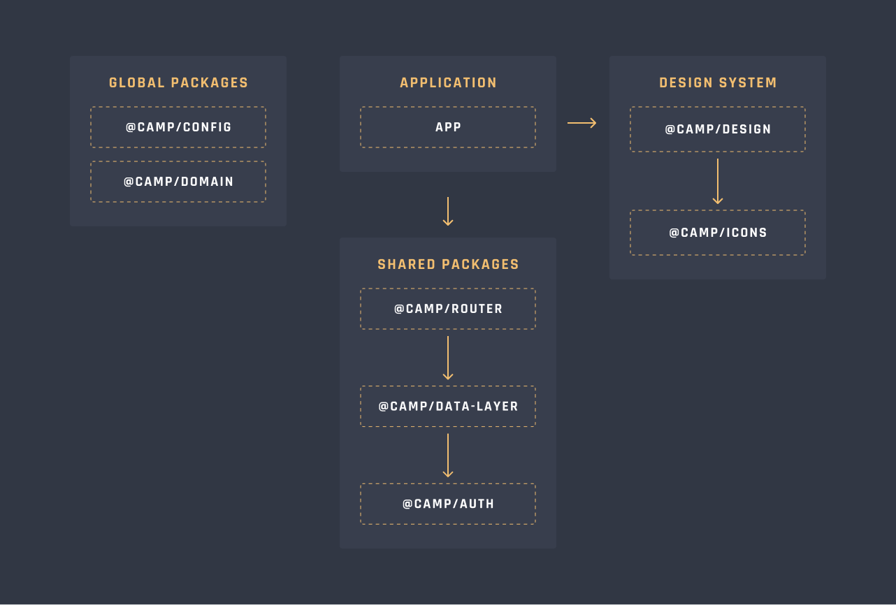

<center>
  
</center>

<center><h1>The Charity</h1></center>

<center>TheCharity is an open-source, non-profit web application created by the FullstacksjsJS community.</center>

<br />
<br />

## CONTRIBUTING

Development of TheCharity happens in GitHub, and we appreciate contributions. Learn how you can help improve TheCharity by reading the sections below.

### Prerequisite:

- [POSIX-compliant shell][shell]
- [git][git] >= 2
- [volta][volta] >= 1

### Branch Organization

- `main`: latest stable release
- `dev`: latest development changes

### Sending a Pull Request

The FullstacksJS team is monitoring for pull requests. We will review your pull request and either merge it, request changes to it, or close it with an explanation.

Before submitting a pull request, please make sure the following is done:

- Fork/Clone the repository and create your feature branch from dev.
- Run `npm install` to have all dependencies and husky hooks needed for development.
- Run `npm run codegen` to have latest API types.
- To start development run `npm start`.
- If you've fixed a bug or added code that should be tested, add tests, please.
- Create a PR (You can use `./scripts/pr` to create one).

### Envs

- `APP_GRAPHQL_SCHEMA_URL`: a valid URL string for graphql path used in graphql tooling.
- `APP_API_ENDPOINT`: a valid URL or path for the GraphQL API used in the application.
- `APP_AUTH0_DOMAIN`: a valid URL string for auth0 domain, more info [here][auth0-react-config].
- `APP_AUTH0_AUDIENCE`: an OAuth2.0 audience, more info [here][oauth-audience].
- `APP_AUTH0_CLIENT_ID`: a valid URL string for auth0 clientId, more info [here][auth0-react-config].
- `APP_HASURA_ADMIN_SECRET`: Hasura admin secret.
- `API_PROXY_TARGET`: the API target proxy URL for the dev environment.
- `PORT`: **Optional** port for running vite dev server, if not provided, will fallback to 3000.
- `HOST`: **Optional** host for running the vite dev server.
- `CY_RECORD_VIDEO`: **Optional** A boolean variable for Cypress video recording (`default=true`).
- `OPEN`: Open the browser on the dev server start (`default=false`).

> Note: if you want to add a new environment variable **to use in client** you should prefix it with `APP_`.

recognized env files:

- `.env.dev`: the env file used for the dev environment

## Architecture

The project contains multiple modules which have their specific responsibilities and rules. Here you can find a big picture of the code architecture and its dependencies and for more detail, you refer to the README file of each module.



<center><i>An arrow from ModuleA to ModuleB means ModuleA depends on ModuleB</i></center>

## Scripts

### Run

To start the app first set the envs as described in the (envs section)[#Envs] then run:

```bash
npm install
npm run codegen
npm run dev
```

> If you're using [VSCode][vscode] you can install the [Apollo Graphql][apollo-graphql-extension] extension to get features like autocomplete in your graphql queries

### Codegen

This project uses [GraphQL Code Generator][codegen] to generate types and interfaces from our API schema. This ensures type safety in our operations and queries, reducing the risk of errors and improving the overall quality of our code.

to generate the latest type from the API you need to have (a proper environment)[#Envs] in place and run:

```bash
npm run codegen
```

### Build

To build the app just run:

```bash
npm run build
```

### Lint

To run the linter to auto-fix all the problems run:

```bash
npm run lint
```

### Test

To run the unit tests run:

```bash
npm run test:unit
```

To run e2e tests you need to have the dev server running at configured port and run:

```bash
npm run test:e2e
```

If you want only to run a specific e2e test based on a pattern you can run the `test:e2ep` command:

```bash
npm run test:e2ep [PATTERN]
```

if the pattern matches more than one file it will still run all of them, for example, the following command will run the `createFamily.cy.ts` and `familyList.cy.ts` test

```bash
npm run test:e2ep family
```

To run component tests run:

```bash
npm run test:component
```

### Storybook

[Storybook][storybook] is used for sandbox development and UI regression testing. It enables us to build and test UI components in isolation, speeding up development and reducing errors.

To run the storybook dev server run:

```bash
npm run storybook
```

### Spell Check

To find spelling errors just run

```bash
npm run spell
```

And if you want to add a new word so that it won't count as a spelling error, just add it to the `.cspell/charity.txt` and separate it with a new line

> Note: These two (linting and finding spelling errors) are run automatically on each commit and the commit won't be done if there's anything wrong, even for the commit messages, so be careful what you write as a commit message :)


[bash]: https://www.gnu.org/software/bash/
[git]: https://git-scm.com/
[nodejs]: https://nodejs.org/en/
[volta]: https://volta.sh/
[npm]: https://www.npmjs.com/
[vitest-extension]:
  https://marketplace.visualstudio.com/items?itemName=ZixuanChen.vitest-explorer
[vscode]: https://code.visualstudio.com/
[apollo-graphql-extension]:
  https://marketplace.visualstudio.com/items?itemName=apollographql.vscode-apollo
[auth0-react-config]:
  https://auth0.com/docs/quickstart/spa/react/interactive#install-the-auth0-react-sdk
[oauth-audience]:
  https://datatracker.ietf.org/doc/html/draft-tschofenig-oauth-audience-00
[shell]: https://en.wikipedia.org/wiki/Unix_shell
[storybook]: https://storybook.js.org/
[codegen]: https://the-guild.dev/graphql/codegen
