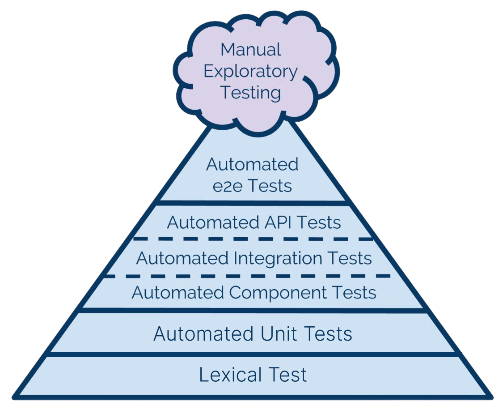

## Preface

This document describes the test strategy for developing and maintaining FullstacksJS software applications. The test strategy lays down the overall approach to verification and validation to the extent it can be generalized for projects.

There are two usage scenarios for this document:

1. As a statement of direction, to drive changes in the way testing is done and
2. To guide projects in the planning of their testing activities.

## Test Strategy

Below is a description of the individual test phases that can be implemented on the projects. The selection of these phases will depend on the project's complexity, size and business priorities. It must be defined per each project in the Test Plan (Defined test phases should be part of the Definition of Done).

### Continuous testing using CI

Continuous integration is a software development practice that facilitates immediate feedback on code quality. In the Testing Approach, Continuous Integration is meant foremost as a paradigm of applying a set of automated testing phases as frequently as possible during the coding stage, with the aim of

- Detecting defects as early as possible
- Minimizing the impact of a defect made by a developer on the rest of his team via immediate feedback on the quality of code and triggering corrective actions
- Minimizing the cost of diagnosing and correcting a problem
- Keeping the application under development stable, an exact sequence of builds, checks, and deployments depends on several factors, including:
- The inherent complexity of the application under test, e.g., dependency on other applications, test environment needs
- Technology in which the application is being developed and the tool set used for development
- Number of tests cases and time needed for their execution

### Test Automation

Automated tests are an indispensable part of the Continuous Testing approach. They represent a powerful regression test suite and are essential for early error detection. To maximize return on investment in test automation, the testing approach will subscribe to the Test Pyramid concept as an example of a long-term process in which the unit tests form the vast majority of automated tests. They thoroughly exercise the code of the application and can be maintained by developers on equal rights with the code they test. The medium layer of the pyramid is made of tests that exercise the functionality of the whole application or its components.

Testing Pyramid

The end-to-end functionality of the application. They are at the top of the test pyramid, i.e., with the least focus on automation because they are less thorough, more expensive to maintain and slower than service tests.

While writing and updating unit tests can be incorporated into a daily development routine of developers l(be part of the Definition of Done for Scrum projects), securing resources for test maintenance is a prerequisite for starting automation of service and UI tests. The details of Test automation should be agreed upon and defined in Test Plan for a particular project. All types of automated tests must be written with coding standards. Test automated scripts must be updated when functionality is changed.

### Regression testing

Regression testing is performed when the previously tested software or its environment is changed. It is done to ensure that defects have not been introduced or uncovered in unchanged software areas due to the changes made. They are verifying that the bugs are fixed, and the newly added features have not created problems in the previous working version of the software. For software under tests, all existing test cases form a pool from which a subset of tests can be selected for regression testing. A regression test suite varies depending on the outcome of impact analysis for the change, the effort needed to execute specific test cases, and the acceptable risk. Test selection criteria should be defined in the Regression strategy in Test Plan.

## Test Environment

**Build verification**: facilitates execution of automated tests following an integration build. This involves the initialization of the environment with specific data sets for deterministic tests.

**Development**: used for frequent daily deployment of builds that passed automated tests but have not yet been subject to manual regression tests. It is used by developers and testers for preliminary testing of Change Requests/Features and the development of tests.

**Test**: a family of environments used for Application and System Integration Testing to verify formally that a requirement has been implemented and to run regression tests. These environments should be as close to the Production environment as is practical. At the same time, they should be isolated enough to be kept in a stable configuration. Separate environments might be needed for functional and for performance testing. Deployments to Test environments are less frequent than they are to Development environments due to the time it takes to execute a test cycle and the need to keep the environment stable throughout the cycle.

**Stage**: Ideally, it is identical to the Production environment and is used for validating the application in its intended environment via Stage Deployment Testing and User Acceptance Testing. The test team's degree of control of this environment might be limited. The Stage environment could be switched with the Production environment at the release time. Production: used for deployment verification and integration with ABB external applications that could not be tested in the stage.

**Production**: used for deployment verification and integration with ABB external applications that could not be tested in stage

## Test Types

### Static Analysis

| Purpose                   | Automatically detect code defects and security vulnerabilities—coding guidelines violations. |
| ------------------------- | -------------------------------------------------------------------------------------------- |
| Development Phase         | Development                                                                                  |
| Test Scope                | Code Validation                                                                              |
| Test Environment          | • Build Verification                                                                         |
| • Development Environment |
| Test Data                 | Source code                                                                                  |
| Role                      | Developer                                                                                    |

### Unit Test

Purpose: The development team performs this test to check those individual units conform to the comprehensive technical specification. Unit tests are white-box tests that should simulate all potential flows. The testing of both positive and negative conditions is required. |
|                   |                                         |
| ----------------- | --------------------------------------- |
| Development Phase | Development and Testing                 |
| Test Scope        | Code Validation                         |
| Test Environment  | Development Environment, CI Environment |
| Test Data         | Manual data created by developers       |
| Role              | Developer                               |

### Functional Integration Test

| Purpose           | Functional testing verifies the complete functionality of interrelated functions, methods, and objects within a functional domain. This contains a set of activities or business processes logically related to achieving a defined business process.  Functional test cases typically consist of a sequence of business processes or stories strung together to form a business process. The reduced size of test cases will allow for examining many data sets and variations.  It occurs after or concurrently with the development phase when all components of a particular flow are complete. In a QA environment, an independent testing team will do functional testing.  These business process (functional) tests are merged to create end-to-end integration test scenarios during future integration testing operations. |
| ----------------- | ------------------------------------------------------------------------------------------------------------------------------------------------------------------------------------------------------------------------------------------------------------------------------------------------------------------------------------------------------------------------------------------------------------------------------------------------------------------------------------------------------------------------------------------------------------------------------------------------------------------------------------------------------------------------------------------------------------------------------------------------------------------------------------------------------------------------------------ |
| Development Phase | Development and Testing                                                                                                                                                                                                                                                                                                                                                                                                                                                                                                                                                                                                                                                                                                                                                                                                              |
| Test Scope        | Functional test, Story coverage                                                                                                                                                                                                                                                                                                                                                                                                                                                                                                                                                                                                                                                                                                                                                                                                      |
| Test Environment  | Test Environment                                                                                                                                                                                                                                                                                                                                                                                                                                                                                                                                                                                                                                                                                                                                                                                                                     |
| Test Data         | Manual data created by the Test team                                                                                                                                                                                                                                                                                                                                                                                                                                                                                                                                                                                                                                                                                                                                                                                                 |
| Role              | QA Team                                                                                                                                                                                                                                                                                                                                                                                                                                                                                                                                                                                                                                                                                                                                                                                                                              |

### System Test

| Purpose           | System testing certifies a comprehensive and self-contained set of business procedures that characterize a business situation at the macro level. This is an end-to-end test of the business process. Typically, a business scenario requires the testing of numerous module test cases concurrently. The primary purpose of this testing is to identify faults in the integration between different modules and to ensure that the modules work as intended. |
| ----------------- | ------------------------------------------------------------------------------------------------------------------------------------------------------------------------------------------------------------------------------------------------------------------------------------------------------------------------------------------------------------------------------------------------------------------------------------------------------------- |
| Development Phase | Development and Testing                                                                                                                                                                                                                                                                                                                                                                                                                                       |
| Test Scope        | • Full end-to-end business process  • Performance Testing • Regression • Interface testing with interfacing systems • Security role-based authorization testing • End to End scenarios executed with user id mapped to actual security roles • Batch jobs execution using scheduled runs • Printers and other devices                                                                                                                                         |
| Test Environment  | QA Environment or Pre-Production                                                                                                                                                                                                                                                                                                                                                                                                                              |
| Test Data         | Automatic Seeded data                                                                                                                                                                                                                                                                                                                                                                                                                                         |
| Role              | QA Team                                                                                                                                                                                                                                                                                                                                                                                                                                                       |

### User Acceptance Test

| Purpose           | The user acceptance test is performed by business users. Users test end-to-end business processes to ensure that the implemented solution performs as planned and meets business requirements. |
| ----------------- | ---------------------------------------------------------------------------------------------------------------------------------------------------------------------------------------------- |
| Development Phase | Pre-Production                                                                                                                                                                                 |
| Test Scope        | User Acceptance, Full Regression                                                                                                                                                               |
| Test Environment  | Pre-Production, Production                                                                                                                                                                     |
| Test Data         | Automatic Seeded data                                                                                                                                                                          |
| Role              | Business Users                                                                                                                                                                                 |

## Testing Tools

| Problem                     | Tools                                                 |
| --------------------------- | ----------------------------------------------------- |
| Static Analysis             | https://eslint.org/                                   |
| E2E Test Automation         | https://www.cypress.io/                               |
| UI Snapshot Testing         | https://storybook.js.org/, https://www.chromatic.com/ |
| Front-end Unit Testing      | https://vitest.dev/, https://jestjs.io/               |
| Front-end Component Testing | https://www.cypress.io/                               |
| Back-end Unit Testing       | https://jestjs.io/                                    |
| API Testing                 | https://vitest.dev/                                   |

## Test Environment

Number of requirements and setup required for each environment

| Name       | Branch         | Purpose                                                                                         |
| ---------- | -------------- | ----------------------------------------------------------------------------------------------- |
| Preview    | Topic branches | For each topic branch there should be a separate preview environment to reflect the changes and |
| Staging    | `dev`          | A mirror of next production release                                                             |
| Production | `main`         | Latest production release                                                                       |
